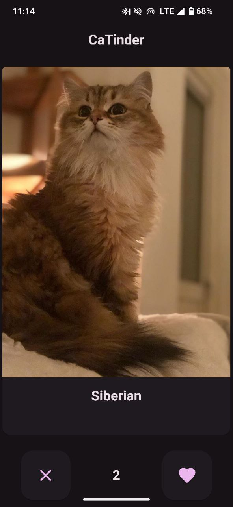
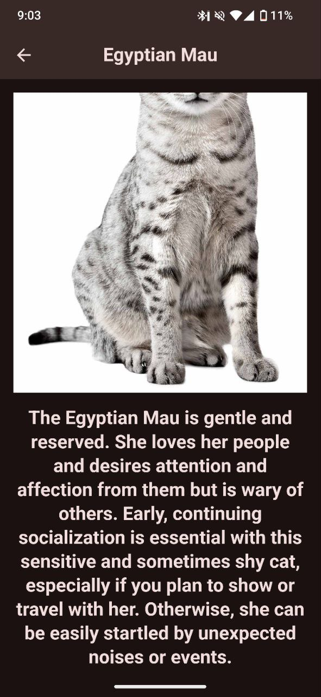
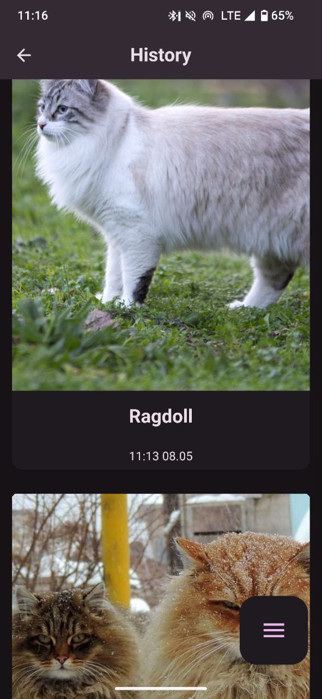
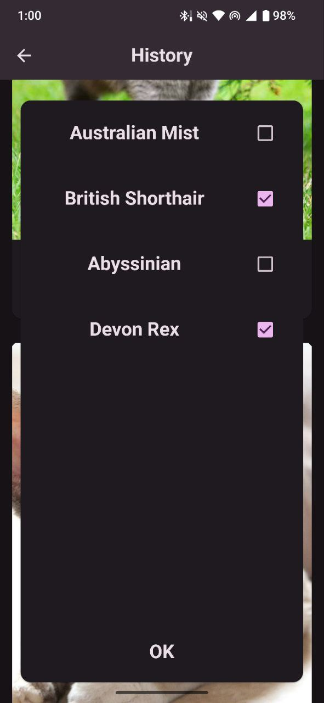
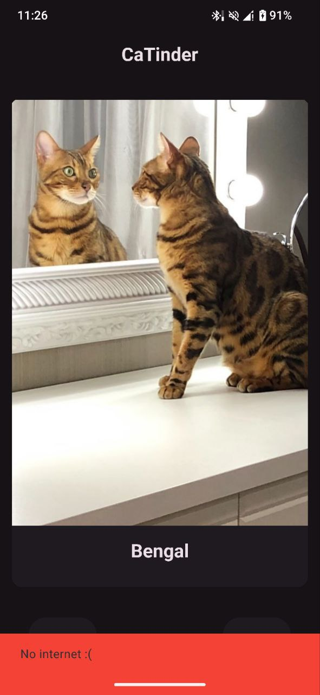

# Catinder - тиндер для котов

## Описание

Тиндер для котиков. Можно смотреть карточки с котиками и свайпать их, как в тиндере
(ставить лайк на свайп вправо)

## Скачать

[Скачать apk](https://disk.yandex.com/d/0i3iRbCPEVFp8w)

## Демо

## Фичи

- Получение карточек с [thecatsapi](thecatapi.com)
- Свайп как в тиндере с анимациями
- Подробная информация о породе при тапе на карточку
- Иконка приложения
- Удобная навигация
- Экран с историей всех лайков
- Возможность удалять лайки
- Возможность фильтровать лайкнутых котиков по породе
- История лайков сохраняется на устройстве локально
- Картинки понравившихся котиков кэшируются
- В случае потери интернета показывается не блокирующее интерфейс сообщение
- Удаление лайков из истории свайпом
- История открывается по клику на количество лайков
