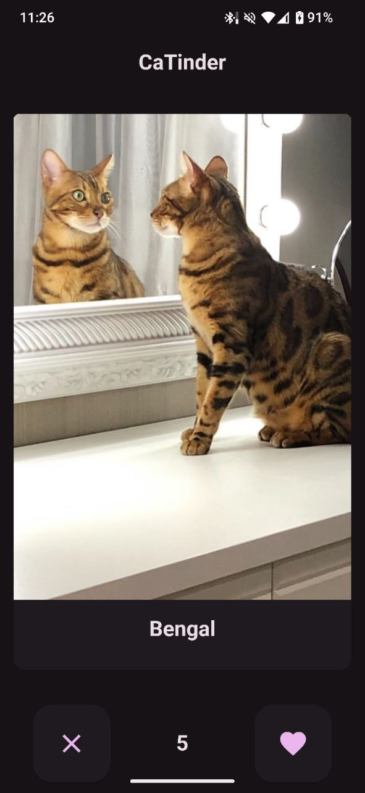
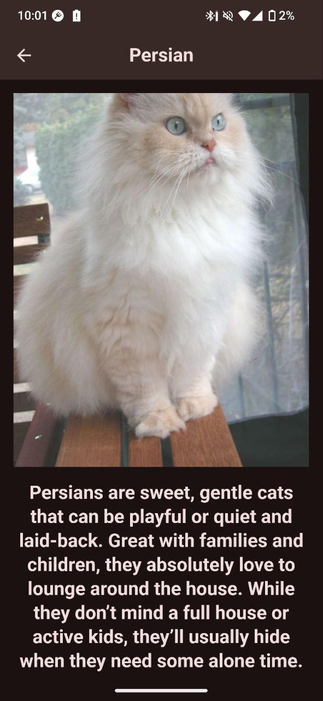

# Catinder - tinder for cats

## Download APK

[Download APK](https://github.com/iv4n-t3a/CaTinder/releases)

## Demo

## Features

- Cards from [The Cat API](thecatapi.com)
- Animated Tinder-like swipe
- Detailed cat info (by tapping on the image)
- Likes history screen
- Remove likes by swiping them out on the history screen
- Filter cats by breed on the history screen
- Local history saving
- Image caching
- "No Internet" bar at the bottom of the screen
- Rubber layout

## Build guide

Get dependencies

    flutter pub get

Obtain api key from [The Cat API](thecatapi.com)

Build apk with your api key

    flutter build apk --release --dart-define=THE_CAT_API_KEY=your-api-key

Or run

    flutter run --dart-define=THE_CAT_API_KEY=your-api-key
    
